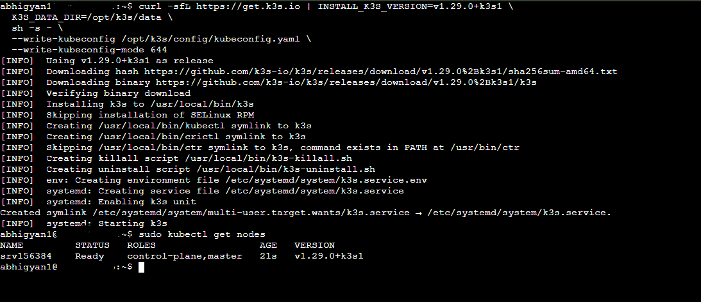
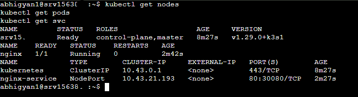
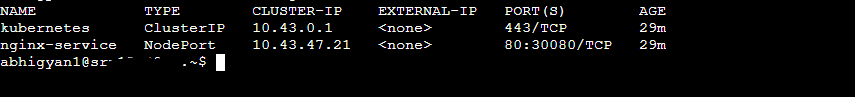
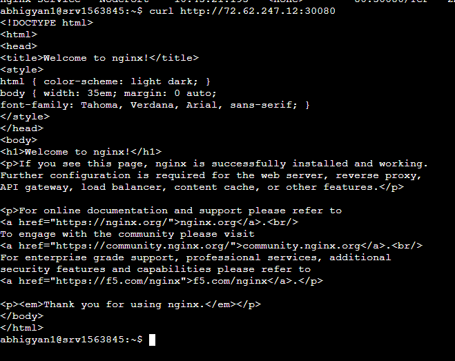
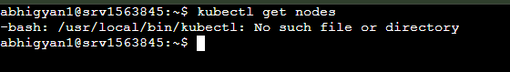
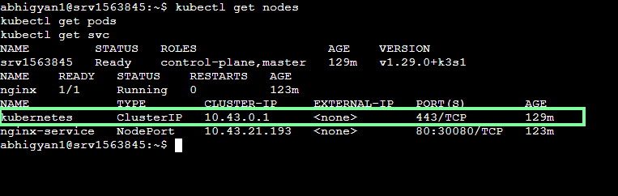

# K3s Deployment Proof | K3s 部署证明

---

## English

### Overview

This document provides proof of a working K3s cluster deployed on Ubuntu 22.04 LTS (Hostinger KVM1), including nginx deployment exposed via NodePort, SSH access instructions, and cluster destroy/recreate steps.

---

### 1. Node Ready

Run the following command to verify the node is in Ready state:

```bash
kubectl get nodes
```

**Expected Output:**
```
NAME       STATUS   ROLES                  AGE   VERSION
srv1563845 Ready    control-plane,master   5m    v1.29.0+k3s1
```

**Screenshot:**



---

### 2. nginx Pod Running

Run the following command to verify the nginx pod is running:

```bash
kubectl get pods
```

**Expected Output:**
```
NAME    READY   STATUS    RESTARTS   AGE
nginx   1/1     Running   0          3m
```

**Screenshot:**



---

### 3. NodePort Service Exposed

Run the following command to verify the NodePort service:

```bash
kubectl get svc
```

**Expected Output:**
```
NAME            TYPE       CLUSTER-IP     PORT(S)        AGE
nginx-service   NodePort   10.43.x.x      80:30080/TCP   3m
```

**Screenshot:**



---

### 4. nginx Welcome Page Accessible

Run the following command to verify nginx is reachable externally:

```bash
curl http://<YOUR_VM_IP>:30080
```

**Expected Output:**
```html
<!DOCTYPE html>
<html>
<head>
<title>Welcome to nginx!</title>
...
</html>
```

**Screenshot:**



---

### 5. SSH Access & Cluster Access

#### SSH into the VM
```bash
ssh abhigyan1@<YOUR_VM_IP>
```

#### Access kubectl after SSH
```bash
kubectl get nodes
kubectl get pods -A
kubectl get svc
```

#### If using custom kubeconfig path
```bash
export KUBECONFIG=/opt/k3s/config/kubeconfig.yaml
kubectl get nodes
```

#### Make kubeconfig permanent
```bash
echo 'export KUBECONFIG=/opt/k3s/config/kubeconfig.yaml' >> ~/.bashrc
source ~/.bashrc
```

#### View kubeconfig file
```bash
cat /opt/k3s/config/kubeconfig.yaml
```

#### Remote access from local machine
```bash
scp abhigyan1@<YOUR_VM_IP>:/opt/k3s/config/kubeconfig.yaml ~/.kube/config
sed -i 's/127.0.0.1/<YOUR_VM_IP>/g' ~/.kube/config
kubectl get nodes
```

---

### 6. Destroy the Cluster

```bash
# Uninstall K3s completely
/usr/local/bin/k3s-uninstall.sh

# Verify it's removed
kubectl get nodes
# Expected: command not found
```
**Screenshot:**



---

### 7. Recreate the Cluster

#### Step 1 — Reinstall K3s
```bash
curl -sfL https://get.k3s.io | INSTALL_K3S_VERSION=v1.29.0+k3s1 \
  K3S_DATA_DIR=/opt/k3s/data \
  sh -s - \
  --write-kubeconfig /opt/k3s/config/kubeconfig.yaml \
  --write-kubeconfig-mode 644
```

#### Step 2 — Verify Node
```bash
kubectl get nodes
```

#### Step 3 — Redeploy nginx Pod
```bash
kubectl apply -f - <<EOF
apiVersion: v1
kind: Pod
metadata:
  name: nginx
  labels:
    app: nginx
spec:
  containers:
  - name: nginx
    image: nginx:latest
    ports:
    - containerPort: 80
EOF
```

#### Step 4 — Redeploy NodePort Service
```bash
kubectl apply -f - <<EOF
apiVersion: v1
kind: Service
metadata:
  name: nginx-service
spec:
  selector:
    app: nginx
  type: NodePort
  ports:
  - port: 80
    targetPort: 80
    nodePort: 30080
EOF
```

#### Step 5 — Verify Everything
```bash
kubectl get nodes
kubectl get pods
kubectl get svc
curl http://<YOUR_VM_IP>:30080
```
**Screenshot:**



---

### 8. Acceptance Checklist

| Check | Command | Status |
|-------|---------|--------|
| Node Ready | `kubectl get nodes` | ✅ |
| Pod Running | `kubectl get pods` | ✅ |
| NodePort Accessible | `curl http://<VM_IP>:30080` | ✅ |
| SSH Access Working | `ssh abhigyan1@<VM_IP>` | ✅ |
| Cluster Destroy Works | `k3s-uninstall.sh` | ✅ |
| Cluster Recreate Works | `curl -sfL https://get.k3s.io` | ✅ |

---
---

## 中文

### 概述

本文档提供在 Ubuntu 22.04 LTS（Hostinger KVM1）上部署 K3s 集群的完整证明，包括通过 NodePort 暴露的 nginx 部署、SSH 访问说明以及集群销毁/重建步骤。

---

### 1. 节点就绪

运行以下命令验证节点处于 Ready 状态：

```bash
kubectl get nodes
```

**预期输出：**
```
NAME       STATUS   ROLES                  AGE   VERSION
srv1563845 Ready    control-plane,master   5m    v1.29.0+k3s1
```

**截图：**


---

### 2. nginx Pod 运行中

运行以下命令验证 nginx Pod 正在运行：

```bash
kubectl get pods
```

**预期输出：**
```
NAME    READY   STATUS    RESTARTS   AGE
nginx   1/1     Running   0          3m
```

**截图：**


---

### 3. NodePort 服务已暴露

运行以下命令验证 NodePort 服务：

```bash
kubectl get svc
```

**预期输出：**
```
NAME            TYPE       CLUSTER-IP     PORT(S)        AGE
nginx-service   NodePort   10.43.x.x      80:30080/TCP   3m
```

**截图：**


---

### 4. nginx 欢迎页面可访问

运行以下命令验证 nginx 可从外部访问：

```bash
curl http://<虚拟机IP>:30080
```

**预期输出：**
```html
<!DOCTYPE html>
<html>
<head>
<title>Welcome to nginx!</title>
...
</html>
```

**截图：**


---

### 5. SSH 访问与集群访问

#### SSH 登录虚拟机
```bash
ssh abhigyan1@<虚拟机IP>
```

#### SSH 登录后访问 kubectl
```bash
kubectl get nodes
kubectl get pods -A
kubectl get svc
```

#### 使用自定义 kubeconfig 路径
```bash
export KUBECONFIG=/opt/k3s/config/kubeconfig.yaml
kubectl get nodes
```

#### 永久设置 kubeconfig
```bash
echo 'export KUBECONFIG=/opt/k3s/config/kubeconfig.yaml' >> ~/.bashrc
source ~/.bashrc
```

#### 查看 kubeconfig 文件
```bash
cat /opt/k3s/config/kubeconfig.yaml
```

#### 从本地机器远程访问
```bash
scp abhigyan1@<虚拟机IP>:/opt/k3s/config/kubeconfig.yaml ~/.kube/config
sed -i 's/127.0.0.1/<虚拟机IP>/g' ~/.kube/config
kubectl get nodes
```

---

### 6. 销毁集群

```bash
# 完全卸载 K3s
/usr/local/bin/k3s-uninstall.sh

# 验证已移除
kubectl get nodes
# 预期：命令未找到
```

---

### 7. 重建集群

#### 第一步 — 重新安装 K3s
```bash
curl -sfL https://get.k3s.io | INSTALL_K3S_VERSION=v1.29.0+k3s1 \
  K3S_DATA_DIR=/opt/k3s/data \
  sh -s - \
  --write-kubeconfig /opt/k3s/config/kubeconfig.yaml \
  --write-kubeconfig-mode 644
```

#### 第二步 — 验证节点
```bash
kubectl get nodes
```

#### 第三步 — 重新部署 nginx Pod
```bash
kubectl apply -f - <<EOF
apiVersion: v1
kind: Pod
metadata:
  name: nginx
  labels:
    app: nginx
spec:
  containers:
  - name: nginx
    image: nginx:latest
    ports:
    - containerPort: 80
EOF
```

#### 第四步 — 重新部署 NodePort 服务
```bash
kubectl apply -f - <<EOF
apiVersion: v1
kind: Service
metadata:
  name: nginx-service
spec:
  selector:
    app: nginx
  type: NodePort
  ports:
  - port: 80
    targetPort: 80
    nodePort: 30080
EOF
```

#### 第五步 — 验证所有内容
```bash
kubectl get nodes
kubectl get pods
kubectl get svc
curl http://<虚拟机IP>:30080
```

---

### 8. 验收清单

| 检查项 | 命令 | 状态 |
|--------|------|------|
| 节点就绪 | `kubectl get nodes` | ✅ |
| Pod 运行中 | `kubectl get pods` | ✅ |
| NodePort 可访问 | `curl http://<虚拟机IP>:30080` | ✅ |
| SSH 访问正常 | `ssh abhigyan1@<虚拟机IP>` | ✅ |
| 集群销毁成功 | `k3s-uninstall.sh` | ✅ |
| 集群重建成功 | `curl -sfL https://get.k3s.io` | ✅ |

      
